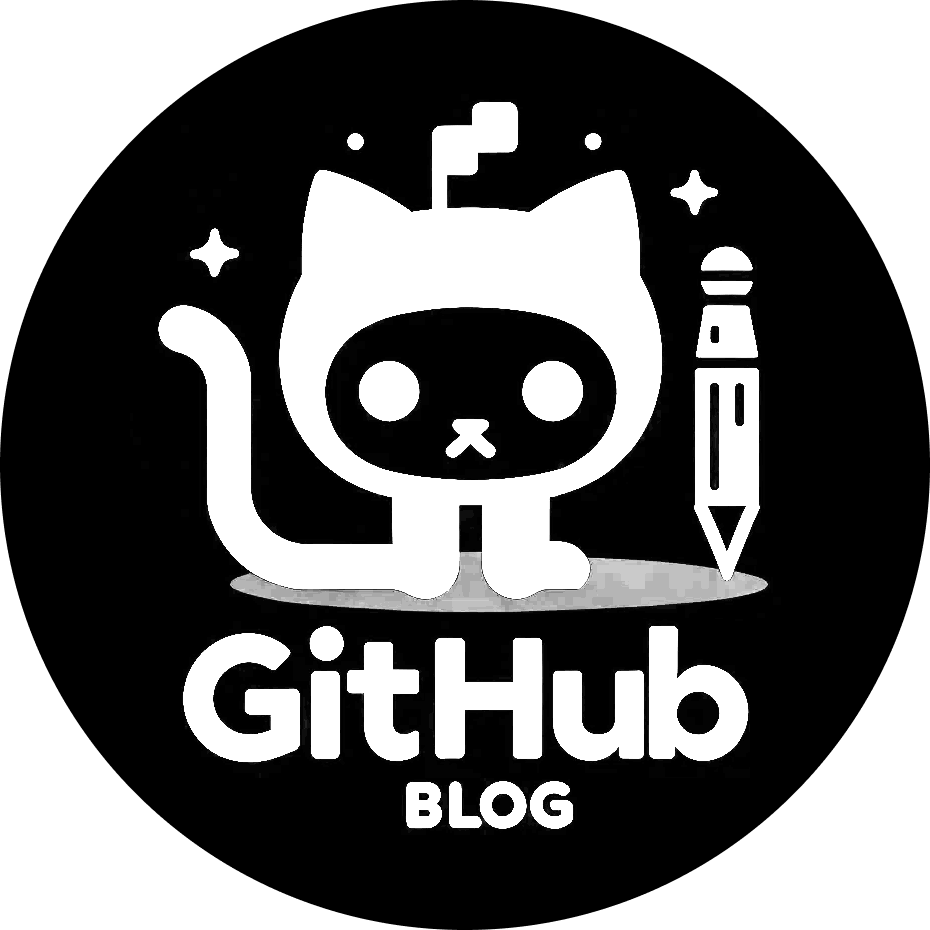

# GitHub Blog Challenge

<div align="center">
    
</div>
## Sobre o Projeto

O GitHub Blog Challenge é uma aplicação que transforma issues de um repositório GitHub específico em postagens de blog. Utilizando a API do GitHub, o projeto busca e exibe issues como se fossem artigos, permitindo que qualquer usuário do GitHub transforme seu repositório em uma plataforma de blogging dinâmica e interativa.

Funcionalidades principais:

- **Perfil GitHub**: Apresenta o perfil do usuário com imagem, número de seguidores, nome e outras informações diretamente da API do GitHub.
- **Lista de Issues/Posts**: Exibe todas as issues do repositório escolhido com um resumo, permitindo a filtragem e busca por conteúdo específico.
- **Visualização de Post**: Permite ler o conteúdo completo de uma issue em formato de post de blog, com a formatação adequada de markdown para HTML.

## Tecnologias Utilizadas

- **React** com **Vite** e **TypeScript** para a base do projeto.
- **Axios** para chamadas de API.
- **react-hook-form** para gerenciamento de formulários.
- **react-router-dom** para roteamento dinâmico na aplicação.
- **react-markdown** para converter conteúdo markdown em HTML.

## Como Funciona

1. **Configuração Inicial**: Crie um repositório público no GitHub. Esse repositório hospedará tanto as issues que serão os posts do seu blog quanto o código-fonte da aplicação.
2. **Criação de Posts**: Utilize as issues do seu repositório para representar os posts do blog. O título da issue corresponderá ao título do post, e o corpo da issue ao conteúdo.
3. **APIs do GitHub**:
   - **[GitHub Users API](https://docs.github.com/pt/rest/users/users#get-a-user)**: Recupera dados do perfil do usuário.
   - **[GitHub Search API](https://docs.github.com/pt/rest/search#search-issues-and-pull-requests)**: Filtra e busca issues por meio de parâmetros na query.
   - **[GitHub Issues API](https://docs.github.com/pt/rest/issues/issues#get-an-issue)**: Obtém os dados completos de uma issue específica.

## Instalação e Execução

Para rodar o projeto em sua máquina local, siga estes passos:

1. Clone o repositório:
   ```sh
   git clone https://github.com/pdro-lucas/github-blog.git
   ```
2. Instale as dependências:
   ```sh
   cd github-blog
   npm install
   ```
3. Crie um arquivo `.env` na raiz do projeto e adicione a variável de ambiente `VITE_GITHUB_TOKEN` com um token de acesso pessoal do GitHub. Para mais informações sobre como criar um token de acesso pessoal, [clique aqui](https://docs.github.com/pt/github/authenticating-to-github/keeping-your-account-and-data-secure/creating-a-personal-access-token).
4. Execute o projeto:
   ```sh
   npm run dev
   ```
5. Acesse o projeto em `http://localhost:5173`.

## Licença

Distribuído sob a licença MIT. Veja `LICENSE` para mais informações.

## Contato

Pedro Lucas - [Twitter](https://twitter.com/pdrolucasX)
